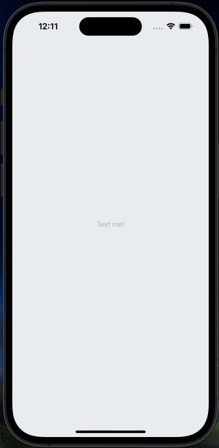
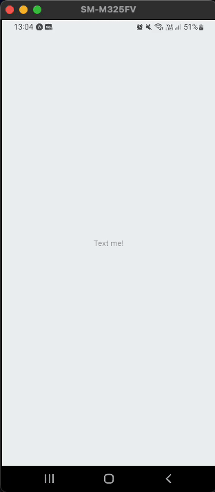
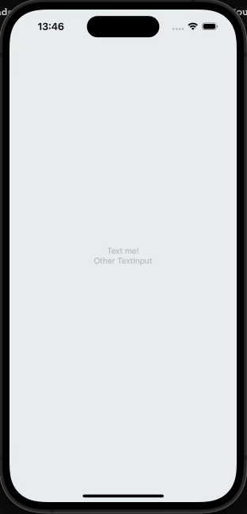
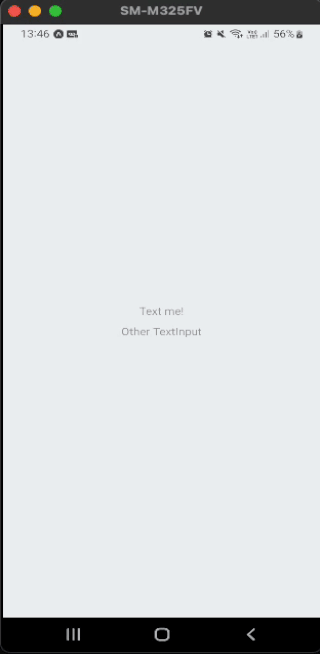

# react native keyboard avoiding input 📲
This library allows you to pass the textinput just above the keyboard, thus floating on it, in cases that this is necessary

All the props are passed down to a new TextInput Component.

|           iOS Example            |           Android Example        |
| :---------------------------: | :---------------------------: |
|  |  |

## Installation

```sh
npm install react-native-keyboard-avoiding-input
```

## Usage

```js
import { TextInput } from 'react-native';
import { KeyboardAvoidingInput } from 'react-native-keyboard-avoiding-input';

// ...

 <KeyboardAvoidingInput
    input={TextInput}

    // Rest props a text input
    placeholder="Text me!"
    style={Style.input}
    value={state}
    onChangeText={setState}
      />
```

## Usage with style-components 💅🏾

```js
import { KeyboardAvoidingInput } from 'react-native-keyboard-avoiding-input';
import styled from 'styled-components/native';


// Custon TextInput with styled-components
const InputAwesome = styled.TextInput`
  width: 100%;
  height: 60px;
  font-size: 18px;
  flex: 1;
  color: #010101;
  margin-left: 10px;
`;

// ...

 <KeyboardAvoidingInput
    input={InputAwesome}

    // Rest props a TextInput
    placeholder="Text me!"
      />
```
## Usage with react-hook-form 📋

```js
import { KeyboardAvoidingInput } from 'react-native-keyboard-avoiding-input';
import styled from 'styled-components/native';
import { Controller, useForm } from 'react-hook-form';


// Custon TextInput with styled-components
const InputAwesome = styled.TextInput`
  width: 100%;
  height: 60px;
  font-size: 18px;
  flex: 1;
  color: #010101;
  margin-left: 10px;
`;

// ...
const {control} = useForm();

<Controller
    name="name"
    control={control}
    render={({ field: { onChange, onBlur, value } }) => (
      <KeyboardAvoidingInput
        input={InputAwesome}

        placeholder="It's me! Carlio"
        onBlur={onBlur}
        onChangeText={onChange}
        value={value}
          />
        )}
      />
```
## How to select the next TextInput
The library exposes some methods through the ref `open`, `close`, `focus`, `clear`

|           iOS Example            |           Android Example        |
| :---------------------------: | :---------------------------: |
|  |  |

```js
import { TextInput } from 'react-native';
import { KeyboardAvoidingInput, KeyboardAvoidingInputHandle } from 'react-native-keyboard-avoiding-input';

// ...

const inputRef = React.useRef<KeyboardAvoidingInputHandle>(null)

 <KeyboardAvoidingInput
    input={TextInput}
    // Rest props a text input
    onSubmitEditing={()=> inputRef.current?.open()}
    placeholder="Text me!"
    />

 <KeyboardAvoidingInput
    input={TextInput}
    ref={inputRef}
    // Rest props a text input
    placeholder="Other input"
    />

```

## Props

| Name   |      Description      |  Details |
|----------|:-------------:|------:|
| input |  React component type TextInput | `required` TextInput Component |
|returnKeyTypeClear| Changes returnKey behavior to clean the TextInput | `boolean` |
|returnKeyLabel| By default the `returnKeyType` is used | `string` |
|returnKeyIcon| Renders an icon in place of `returnKeyLabel` or `returnKeyType` text  | `React component` |
|toggleVisibilityPassword| Renders toggle for show and hide pass, required `secureTextEntry` | `boolean` |
|toggleShowText|Change the text of `Show` when toggleVisibilityPassword is true | `string` |
|toggleHideText| Change the text of `Hide` when toggleVisibilityPassword is true | `string` |
|showPasswordIcon| Renders an icon in place of `Show` | `React component` |
|hidePasswordIcon|Renders an icon in place of `Hide`| `React component` |
|actionLabelStyle| responsible for the style of the texts of `Done`, `Clear`, `Hide` or `Show` | `StyleProp<TextStyle>` |
|actionContainerStyle| responsible for the container of the action text | `StyleProp<ViewStyle>` |
|containerStyle| Responsible for the `KeyboardAvoidingInput` container style | `StyleProp<ViewStyle>` |
|inputStyle| Responsible for the `KeyboardAvoidingInput` style | `StyleProp<TextInputStyle>`  |
|onOpen| function called the input is opened | `function` |
|onClose| function called the input is closed| `function` |

## Contributing

See the [contributing guide](CONTRIBUTING.md) to learn how to contribute to the repository and the development workflow.

## Give me a Star
If you think this project is helpful just give me a ⭐️ :D

## License

react-native-keyboard-avoiding-input is [MIT licensed](https://github.com/godrix/react-native-keyboard-avoiding-input/tree/main/LICENSE) and built with ❤️ in 🇧🇷 by [Godrix](https://www.linkedin.com/in/carlosgodri/)

